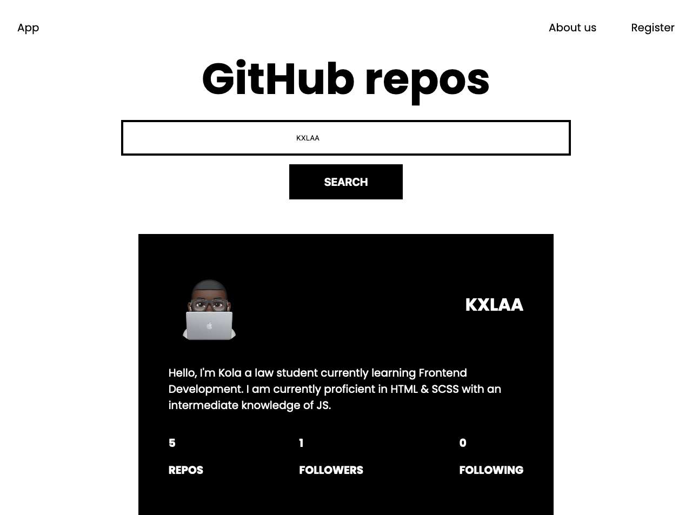

# GitHub API Project

This is my first API project with Javascript, i utilised an object Oriented approach with this project by utilising a FetchWrapper class to consume fetch function, this class can be expanded to accommodate other API methods like Post & Put.

The project uses the GitHub API to fetch user details like status and number of repos when a user provides a GitHub username. The project is not perfect as it was my first and with it i got familiar with making API requests.

To enumerate the key issues with the project currently:

- The web page is not currently responsive
- The data being fetched is of no practical value to a potential user as the data fetched can be retrieved directly and more easily from GitHub.

As such i plan to I plan to build on this project and reimplement a new idea. The idea is to create a site that fetches and displays the most stared repos on GitHub based on specific categories like programming language or use case. I don't know if this is possible 🤔 but i will keep the readme updated as i make progress.

## Authors

- [@KXLAA 🤙](https://github.com/KXLAA)

  
## Screenshots

